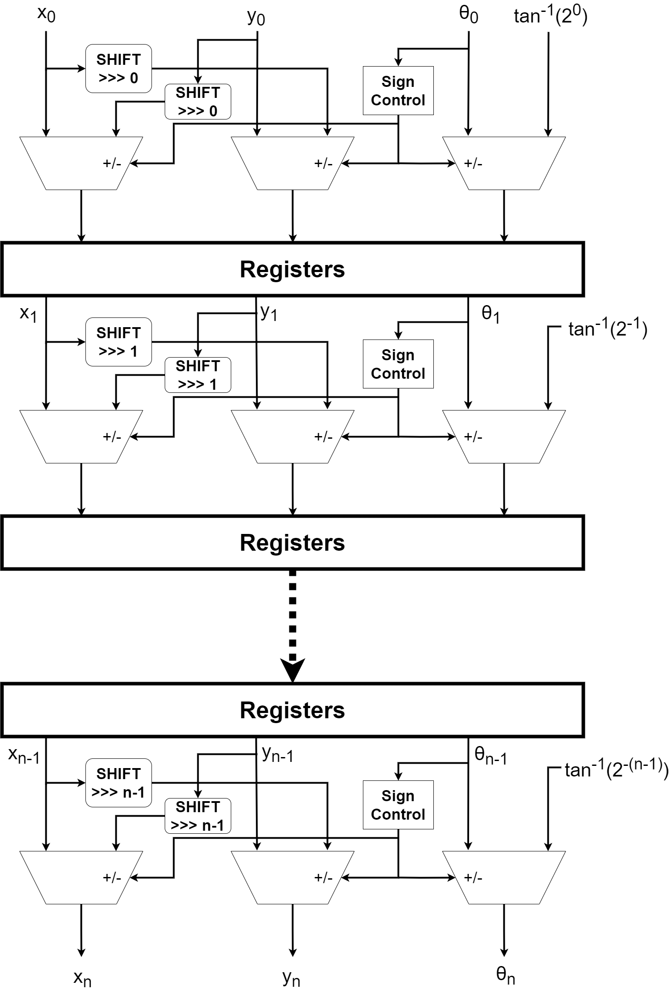

# DDFS CORDIC

## Introduction

This project is about signal synthesis. 

This repository contains the source code of a a pipelined architecture for Direct Digital Frequency Synthesis inspired by the CORDIC Algorithm. The results with the Nexys Video FPGA board can be found inside the paper [“Efficient DDFS Architecture with Pipelined CORDIC for High-Frequency Signal Generation on FPGA”](https://www.researchgate.net/publication/386371225_Efficient_DDFS_Architecture_with_Pipelined_CORDIC_for_High-Frequency_Signal_Generation_on_FPGA/stats).

 

## DDFS with CORDIC

Direct Digital Frequency Synthesis (DDFS) is a digital technique for generating waveforms, such as sine waves, with high precision and flexibility. At its core, DDFS relies on a phase accumulator, which increments a phase value at a fixed rate, and a phase-to-amplitude mapping system, typically implemented using a lookup table (LUT) or algorithms like CORDIC, to convert the phase information into the desired waveform.

 

The CORDIC (COordinate Rotation DIgital Computer) algorithm is a computational method used to efficiently calculate trigonometric, hyperbolic, and other mathematical functions. It works through iterative shift-and-add operations, eliminating the need for multipliers, which makes it highly suitable for hardware implementations like FPGAs. The Mathematical explanation can be found inside the Article in the section Application and System Model.

#### Phase Accumulator Block

The Phase Accumulator Block ([cordic_angle_acc](/rtl/cordic_angle_acc.sv)) has to send angle depending on the frequency chosen. Meaning, when the chosen frquency is 1 MHz, the angles send during one second must have realized 1 million turn of the trigonometric circle. 

Of course, in order to do that, the system’s clock frequency must be really fast (more than 300MHz in this case) .

 

 

 

#### The CORDIC’s Phase to Amplitude mapping
 

The CORDIC PAM or CORDIC core ([cordic.sv](rtl/cordic.sv)) produces the sine and cosine value according to the angle send on the input angle_i that comes from the Phase Accumulator. Inside the core, a number N of stages ([cordic_unit.sv](rtl/cordic_unit.sv)). 

 

 

The input angle_i correspond to the input θ_0 and the ouput sine_o and cosine_o correspond to the output x_n and y_n.

## Technical Specifications

The [testbench](tb/tb_cordic_test.sv) test the whole DDFS system. There are a few parameters that permits to change the behaviour of the system:
* FREQ_START : represents the smallest frequency produced by the system and also the step Frequency
    * Meaning, for example, if FREQ_START = 1 000 000 (1MHz) and freq_i = 25, then the frequency of the sine and cosin wave produced at the ouput of the [cordic](rtl/cordic.sv) module will be freq_out = FREQ_START * freq_i = 25 MHz 

* CLK_FREQ : frequency of the period of the clock inside the testbench
* DATA_WIDTH : size of the sine and cosine values and angle value.
* PARAMETER_WIDTH: size of the parameters inside the [cordic_angle_acc](rtl/cordic_angle_acc.sv) module. The bigger it is, the more accurate will the angle and the frequency of the cosine and sine wave will be
* ITERATIONS : represents the number of iteration chosen for the algorithm and implementation. Meaning, it's the number of stages so number of [cordic_unit](rtl/cordic_unit.sv) instantiate inside the [cordic](rtl/cordic.sv) module.

 